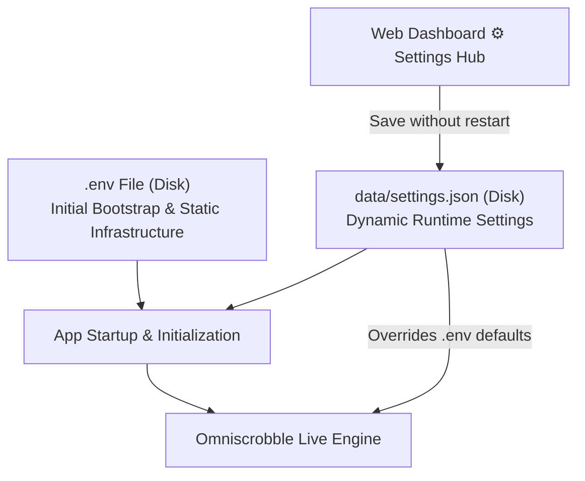
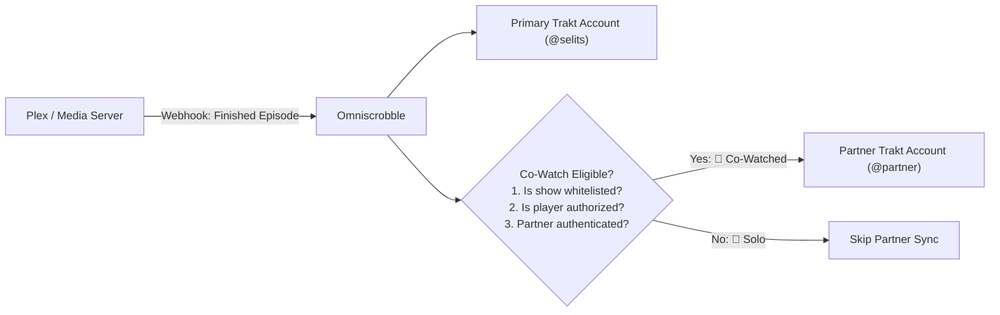

# Omniscrobble Configuration & Credential Guide

This document is the comprehensive reference manual for configuring **Omniscrobble**. It explains the two-tier configuration architecture, provides step-by-step instructions for extracting API keys and tokens from all supported media servers and trackers, details homelab networking patterns, and provides an exhaustive environment variable reference.

<p align="center">
  <a href="README.md"><b>Overview</b></a> •
  <a href="CONFIGURATION.md"><b>Configuration Guide</b></a> •
  <a href="DEPLOYMENT.md"><b>Deployment Guide</b></a> •
  <a href="docs/API.md"><b>API Reference</b></a> •
  <a href="https://selits.github.io/omniscrobble/"><b>Live Demo</b></a>
</p>

---

## 📑 Table of Contents

1. [Configuration Architecture](#1-configuration-architecture)
   - [.env File vs. Runtime Dashboard Settings](#env-file-vs-runtime-dashboard-settings)
   - [Precedence & Persistence Rules](#precedence--persistence-rules)
2. [Media Server Credentials & Webhook Setup](#2-media-server-credentials--webhook-setup)
   - [Plex Media Server](#plex-media-server)
   - [Jellyfin Media Server](#jellyfin-media-server)
   - [Emby Media Server](#emby-media-server)
3. [Acquisition Stack (*Arr Automation)](#3-acquisition-stack-arr-automation)
   - [Sonarr Setup & API Key](#sonarr-setup--api-key)
   - [Radarr Setup & API Key](#radarr-setup--api-key)
   - [Trakt Watchlist Auto-Downloader](#trakt-watchlist-auto-downloader)
4. [Tracker Developer Applications & OAuth Setup](#4-tracker-developer-applications--oauth-setup)
   - [Trakt.tv (Primary Tracker)](#trakttv-primary-tracker)
   - [Simkl (Movies, Shows, Anime)](#simkl-movies-shows-anime)
   - [AniList (Anime Engine)](#anilist-anime-engine)
   - [MyAnimeList (MAL Anime Engine)](#myanimelist-mal-anime-engine)
5. [Watch Together & Multi-User Accounts](#5-watch-together--multi-user-accounts)
   - [Co-Watching Architecture](#co-watching-architecture)
   - [Configuring Partner Synchronization](#configuring-partner-synchronization)
   - [Whitelisting Shows & Hardware Players](#whitelisting-shows--hardware-players)
6. [Multi-Channel Notification Setup](#6-multi-channel-notification-setup)
   - [Discord Webhook](#discord-webhook)
   - [Telegram Bot & Chat ID](#telegram-bot--chat-id)
   - [Ntfy Push Notifications](#ntfy-push-notifications)
   - [Pushover Push Alerts](#pushover-push-alerts)
7. [Complete Environment Variable Reference](#7-complete-environment-variable-reference)
8. [Homelab Networking & Troubleshooting](#8-homelab-networking--troubleshooting)
   - [Docker Inter-Container Networking](#docker-inter-container-networking)
   - [Reverse Proxy & SSL Headers](#reverse-proxy--ssl-headers)
   - [Local Self-Signed SSL Certificates](#local-self-signed-ssl-certificates)

---

## 1. Configuration Architecture

Omniscrobble utilizes a **two-tier configuration model** designed to balance initial infrastructure bootstrapping with seamless runtime operations:

### .env File vs. Runtime Dashboard Settings



1. **Static / Bootstrap Configuration (`.env`)**:
   - Variables that configure the application's runtime environment, host bindings, network ports, core secrets, and file paths.
   - Examples: `SERVER_PORT`, `SERVER_HOST`, `TRAKT_CLIENT_ID`, `TRAKT_CLIENT_SECRET`, `WEBHOOK_SECRET`, `QUEUE_DB_FILE`.
   - Modifying these variables requires a service restart (`systemctl --user restart omniscrobble` or `docker compose restart`).

2. **Dynamic Runtime Configuration (`data/settings.json`)**:
   - Variables that control feature toggles, tracker dispatches, media server connection URLs/tokens, and automation settings.
   - Examples: Media server listeners (`PLEX_ENABLED`, `JELLYFIN_ENABLED`, `EMBY_ENABLED`), Scrobble thresholds, Sonarr/Radarr credentials, Two-way sync intervals.
   - Configurable directly in your web browser via the **⚙️ Settings Hub** modal on the dashboard.
   - Changes take effect **immediately** in the active running service without restarting.

### Precedence & Persistence Rules

- **On Clean Installation**: Omniscrobble reads initial defaults from `.env`. All media server listeners remain disabled (`false`) by default for privacy and safety.
- **When Saving via Settings Hub**: Modified settings are committed to `data/settings.json`.
- **Precedence**: Values in `data/settings.json` **supersede** `.env` defaults on subsequent startups.
- **State Isolation**: `data/settings.json` is stored in the persistent `data/` volume and is never tracked by git.

---

## 2. Media Server Credentials & Webhook Setup

### Plex Media Server

#### Finding Your Plex Server URL

Your Plex URL is the network address where Omniscrobble can send HTTP API requests to your Plex Media Server:

- **Local Network**: `http://<your-server-ip>:32400` *(e.g., `http://192.168.1.50:32400`)*.
- **Localhost (Same Machine)**: `http://127.0.0.1:32400`.
- **Docker (Omniscrobble in container, Plex on host)**: Use the Docker host gateway:
  - Linux/Docker: `http://172.17.0.1:32400` or `http://host.docker.internal:32400` (with `extra_hosts`).
  - Docker Container-to-Container (same Docker network): `http://plex:32400`.
- **Reverse Proxy / Custom Domain**: `https://plex.<your-domain>.com`.

> [!TIP]
> Verify your Plex URL by opening `http://<your-server-ip>:32400/identity` in a browser. It should return XML containing your `machineIdentifier`.

#### Finding Your `X-Plex-Token`

The `X-Plex-Token` is your personal Plex authentication token required for two-way library reconciliation and ratings synchronization.

##### Method A: "View XML" in Plex Web (Recommended — 15 Seconds)
1. Open [Plex Web](https://app.plex.tv/desktop) in your browser.
2. Navigate to **any** movie or episode in your library.
3. Click the three dots menu (**`...`**) on the media poster or details page.
4. Select **Get Info** (or *View Info*).
5. In the lower-left corner of the modal, click **View XML**.
6. A new browser tab opens displaying raw XML. Look at your browser's **address bar** (the URL):
   ```text
   https://...plex.direct:32400/library/metadata/12345?X-Plex-Token=<your-plex-token>
   ```
7. Copy the alphanumeric string after `X-Plex-Token=`. This is your personal Plex token.

##### Method B: Browser Developer Tools
1. Open [Plex Web](https://app.plex.tv/desktop) while signed into your Plex account.
2. Press `F12` (or right-click &rarr; *Inspect* &rarr; switch to the **Application** or **Storage** tab).
3. Under **Local Storage**, select `https://app.plex.tv`.
4. Locate the key named **`myPlexAccessToken`**.
5. Copy the associated value.

#### Adding the Webhook to Plex Media Server
*(Requires Plex Pass)*

1. Open Plex Web &rarr; Click **Settings** (wrench icon top-right).
2. Under your account settings in the left sidebar, click **Webhooks**.
3. Click **Add Webhook**.
4. Enter your Omniscrobble webhook URL:
   ```text
   http://<your-omniscrobble-ip>:8080/webhook
   ```
   *(If you configured a `WEBHOOK_SECRET`, append `?token=<your-webhook-secret>`)*.
5. Click **Save Changes**.

---

### Jellyfin Media Server

#### Finding Your Jellyfin Server URL
- **Local Network**: `http://<your-server-ip>:8096` *(e.g., `http://192.168.1.50:8096`)*.
- **Secure Reverse Proxy**: `https://jellyfin.<your-domain>.com`.

#### Generating a Jellyfin API Key
1. Log into your Jellyfin web interface with an **Administrator** account.
2. Click the hamburger menu (top left) &rarr; **Administration Dashboard**.
3. In the left navigation sidebar under **Advanced**, click **API Keys**.
4. Click the **`+`** (Add) button.
5. Enter `Omniscrobble` as the App Name and click **OK**.
6. Copy the generated 32-character API key string.

#### Finding Your Jellyfin User ID
1. In the Jellyfin **Administration Dashboard**, click **Users** under the *Server* section.
2. Click on the user profile you want Omniscrobble to sync with Trakt.
3. Look at the browser's address bar (URL):
   ```text
   http://<your-server-ip>:8096/web/#/useredit.html?userId=<your-32-character-user-id>
   ```
4. Copy the 32-character string following `userId=`. This is your Jellyfin `user_id`.

#### Adding the Webhook to Jellyfin
*(Free & Open Source — No premium pass required)*

1. In the Jellyfin Dashboard &rarr; **Plugins** &rarr; **Catalog**.
2. Find and install the official **Webhook** plugin, then restart Jellyfin if prompted.
3. In the Dashboard under **Plugins**, click **Webhook**.
4. Click **Add Generic Destination**:
   - **Webhook Name**: `Omniscrobble`
   - **Webhook URL**: `http://<your-omniscrobble-ip>:8080/webhook/jellyfin?token=<WEBHOOK_SECRET>`
   - **Notification Type**: Check `PlaybackStart`, `PlaybackPause`, `PlaybackUnpause`, `PlaybackStop`, `UserDataSaved` (for ratings).
   - **Item Type**: Check `Movies` and `Episodes`.
   - **Send All Properties (JSON)**: Checked.
5. Click **Save**.

---

### Emby Media Server

#### Finding Your Emby Server URL
- **Local Network**: `http://<your-server-ip>:8096` *(e.g., `http://192.168.1.50:8096`)*.
- **Reverse Proxy**: `https://emby.<your-domain>.com`.

#### Generating an Emby API Key
1. Open the Emby web client &rarr; Click the **Settings** (gear) icon in the top right.
2. In the left sidebar under **Advanced**, select **API Keys**.
3. Click **New API Key**.
4. Enter `Omniscrobble` as the application name and click **OK**.
5. Copy the generated API Key.

#### Finding Your Emby User ID
1. In the Emby Server Dashboard, select **Users** in the left sidebar.
2. Click on your user account name.
3. Inspect the browser address bar:
   ```text
   http://<your-server-ip>:8096/web/index.html#!/users/useredit.html?userId=<your-user-id>
   ```
4. Copy the value of `userId=`.

#### Adding the Webhook to Emby
*(Requires Emby Premiere)*

1. In Emby Server Settings, click **Webhooks** under the *Server* category.
2. Click **Add Webhook**.
3. Set **Webhook URL** to:
   ```text
   http://<your-omniscrobble-ip>:8080/webhook/emby?token=<WEBHOOK_SECRET>
   ```
4. Under **Events**, enable:
   - *Playback*: Playback Start, Playback Pause, Playback Unpause, Playback Stop.
   - *User Data*: Rating Changed / User Data Changed.
5. Click **Save**.

---

## 3. Acquisition Stack (*Arr Automation)

Omniscrobble's **Content Bridge** connects your Trakt Watchlist directly to Sonarr and Radarr, automatically searching and queuing bookmarked movies and shows for download.

### Sonarr Setup & API Key

1. Open your Sonarr web interface.
2. Navigate to **Settings &rarr; General &rarr; Security**.
3. Under the *Security* section, locate **API Key**.
4. Click the copy icon to copy your 32-character key.
5. In Omniscrobble:
   - **SONARR_URL**: `http://<sonarr-ip>:8989` *(or `http://<sonarr-ip>:8989/sonarr` if you configured a URL Base)*.
   - **SONARR_API_KEY**: The API key copied above.

### Radarr Setup & API Key

1. Open your Radarr web interface.
2. Navigate to **Settings &rarr; General &rarr; Security**.
3. Locate and copy your **API Key**.
4. In Omniscrobble:
   - **RADARR_URL**: `http://<radarr-ip>:7878` *(or `http://<radarr-ip>:7878/radarr`)*.
   - **RADARR_API_KEY**: The API key copied above.

### Trakt Watchlist Auto-Downloader

Configure automated synchronization between your Trakt Watchlist and Sonarr/Radarr:

```ini
# Automatically add movies and shows added to your Trakt watchlist
AUTO_ADD_FROM_WATCHLIST=true

# Trigger an immediate download search when adding to Sonarr/Radarr
SEARCH_ON_ADD=true

# Polling interval in seconds (0 = manual via UI only, 1800 = every 30 minutes)
ARR_WATCHLIST_INTERVAL=1800

# Optional: Specific Quality Profile ID and Root Folder path
# If left blank, Omniscrobble automatically uses the first available profile and folder
SONARR_QUALITY_PROFILE_ID=
SONARR_ROOT_FOLDER=
RADARR_QUALITY_PROFILE_ID=
RADARR_ROOT_FOLDER=
```

---

## 4. Tracker Developer Applications & OAuth Setup

### Trakt.tv (Primary Tracker)

1. Sign in to your account at [Trakt.tv](https://trakt.tv).
2. Go to [Trakt API Applications](https://trakt.tv/oauth/applications) and click **New Application**.
3. Fill in the application fields:
   - **Name**: `Omniscrobble` (or any label you prefer).
   - **Description**: `Media server scrobbler bridge`.
   - **Redirect URI**: 
     ```text
     urn:ietf:wg:oauth:2.0:oob
     ```
   - **Permissions**: Check `/scrobble` and `/checkin`.
4. Click **Save Application**.
5. Copy the displayed **Client ID** and **Client Secret** into your `.env`:
   ```ini
   TRAKT_CLIENT_ID=your_client_id_here
   TRAKT_CLIENT_SECRET=your_client_secret_here
   ```
6. Complete initial authorization by starting Omniscrobble and visiting `http://<your-server-ip>:8080/auth`.

---

### Simkl (Movies, Shows, Anime)

1. Sign in to [Simkl](https://simkl.com).
2. Go to the [Simkl Developer Applications](https://simkl.com/settings/developer/) page.
3. Click **New App**:
   - **App Name**: `Omniscrobble`
   - **Redirect URI**: `http://localhost` (or `urn:ietf:wg:oauth:2.0:oob`)
4. Copy the generated **Client ID** and **Client Secret**:
   ```ini
   SIMKL_ENABLED=true
   SIMKL_CLIENT_ID=your_simkl_client_id_here
   SIMKL_CLIENT_SECRET=your_simkl_client_secret_here
   ```
5. Authorize Simkl in Omniscrobble by opening `http://<your-server-ip>:8080/auth/simkl` and entering the generated PIN code on Simkl's activation page.

---

### AniList (Anime Engine)

1. Sign in to [AniList](https://anilist.co).
2. Navigate to [AniList Developer Settings](https://anilist.co/settings/developer).
3. Click **Create New Client**:
   - **Name**: `Omniscrobble`
   - **Redirect URL**: 
     ```text
     http://<your-omniscrobble-ip>:8080/auth/anilist/callback
     ```
     *(If using a reverse proxy with a custom domain, use `https://omniscrobble.yourdomain.com/auth/anilist/callback`)*.
4. Click **Save**.
5. Copy your **Client ID** and **Client Secret**:
   ```ini
   ANIME_AUTO_DETECT=true
   ANILIST_ENABLED=true
   ANILIST_CLIENT_ID=your_anilist_client_id_here
   ANILIST_CLIENT_SECRET=your_anilist_client_secret_here
   ```
6. Authorize AniList by navigating to `http://<your-server-ip>:8080/auth/anilist`.

---

### MyAnimeList (MAL Anime Engine)

1. Sign in to [MyAnimeList](https://myanimelist.net).
2. Go to [MyAnimeList API Configuration](https://myanimelist.net/apiconfig).
3. Click **Create ID**:
   - **App Name**: `Omniscrobble`
   - **App Type**: Select **`other`**.
   - **App Redirect URL**: 
     ```text
     http://<your-omniscrobble-ip>:8080/auth/mal/callback
     ```
4. Submit the form.
5. Copy your **Client ID** and **Client Secret**:
   ```ini
   MAL_ENABLED=true
   MAL_CLIENT_ID=your_mal_client_id_here
   MAL_CLIENT_SECRET=your_mal_client_secret_here
   ```
6. Authorize MyAnimeList by visiting `http://<your-server-ip>:8080/auth/mal`.

---

## 5. Watch Together & Multi-User Accounts

### Co-Watching Architecture

Omniscrobble's **Co-Watching Engine** solves the "shared watch history" dilemma. When you watch a TV show together with a partner or roommate, Omniscrobble automatically scrobbles and syncs the episode to **both** of your Trakt profiles simultaneously. Solo shows remain exclusive to your own profile.



### Configuring Partner Synchronization

1. Set the partner Trakt username in `.env`:
   ```ini
   CO_WATCH_USER=partner_username
   ```
2. Authorize the partner's Trakt account by visiting:
   ```text
   http://<your-omniscrobble-ip>:8080/auth?user=partner_username
   ```
   Tokens are saved in an isolated credential file (`data/tokens/partner_username_tokens.json`).

### Whitelisting Shows & Hardware Players

```ini
# Comma-separated list of TV show titles to co-watch
CO_WATCH_SHOWS=The Bear, Severance, House of the Dragon, Succession

# Optional: Restrict co-watching to specific living room TV devices
CO_WATCH_PLAYERS=Living Room Apple TV, Shield TV Pro, Main TV

# Also dual-sync movies watched together
CO_WATCH_MOVIES=false
```

> [!TIP]
> You can add shows dynamically to your shared co-watch whitelist on your mobile phone or desktop without restarting the service by clicking the **`+ Co-Watch`** button in the Recent Activity table.

---

## 6. Multi-Channel Notification Setup

Omniscrobble can send instant notifications when media is scrobbled, rated, added to collections, or when tracker APIs encounter rate limits or outages.

### Discord Webhook
1. In your Discord server, go to **Channel Settings &rarr; Integrations &rarr; Webhooks**.
2. Click **New Webhook**, customize the name and avatar, and click **Copy Webhook URL**.
3. In `.env`:
   ```ini
   DISCORD_WEBHOOK_URL=https://discord.com/api/webhooks/<your_webhook_id>/<your_webhook_token>
   ```

### Telegram Bot & Chat ID
1. Open Telegram and search for `@BotFather`. Send `/newbot`, choose a name, and copy the generated **Bot Token**.
2. Start a chat with your new bot and send `/start`.
3. To find your numeric **Chat ID**, send a message to `@userinfobot` on Telegram.
4. In `.env`:
   ```ini
   TELEGRAM_BOT_TOKEN=your_telegram_bot_token_here
   TELEGRAM_CHAT_ID=your_telegram_chat_id_here
   ```

### Ntfy Push Notifications
1. Choose a topic name on public [ntfy.sh](https://ntfy.sh) or your self-hosted Ntfy server.
2. In `.env`:
   ```ini
   NTFY_URL=https://ntfy.sh/your_topic_name
   NTFY_PRIORITY=default
   # Optional Bearer token if your self-hosted topic requires authentication:
   NTFY_AUTH_TOKEN=
   ```

### Pushover Push Alerts
1. Log in to [Pushover](https://pushover.net) and copy your **User Key**.
2. Click **Create an Application/API Token**, name it `Omniscrobble`, and copy the **API Token**.
3. In `.env`:
   ```ini
   PUSHOVER_USER_KEY=your_pushover_user_key_here
   PUSHOVER_API_TOKEN=your_pushover_api_token_here
   PUSHOVER_PRIORITY=0
   ```

---

## 7. Complete Environment Variable Reference

| Variable | Default | Type | Runtime Editable? | Description |
|---|---|---|:---:|---|
| **`SERVER_HOST`** | `0.0.0.0` | String | No | Network interface binding. Must be `0.0.0.0` for Docker, LAN, and remote VPS access. |
| **`SERVER_PORT`** | `8080` | Integer | No | TCP port Omniscrobble listens on. |
| **`DEBUG`** | `false` | Boolean | No | Enables verbose debug logging and traceback outputs. |
| **`WEBHOOK_SECRET`** | `""` | String | No | Secret token protecting endpoints (`?token=...`) and locking the admin dashboard. |
| **`PLEX_ENABLED`** | `false` | Boolean | **Yes** | Enables ingestion of incoming Plex webhooks (`/webhook`). |
| **`JELLYFIN_ENABLED`** | `false` | Boolean | **Yes** | Enables ingestion of incoming Jellyfin webhooks (`/webhook/jellyfin`). |
| **`EMBY_ENABLED`** | `false` | Boolean | **Yes** | Enables ingestion of incoming Emby webhooks (`/webhook/emby`). |
| **`PLEX_ALLOWED_USERS`** | `""` | String (CSV) | **Yes** | Comma-separated usernames allowed to scrobble. If empty, all users scrobble. |
| **`ALLOWED_LIBRARIES`** | `""` | String (CSV) | **Yes** | Whitelist of library section names to track (e.g., `Movies, TV Shows`). |
| **`EXCLUDED_LIBRARIES`** | `Home Videos...` | String (CSV) | **Yes** | Blacklist of library section names to ignore (e.g., `Fitness, Home Videos`). |
| **`SCROBBLE_MODE`** | `scrobble` | String | **Yes** | `scrobble` (real-time play/pause/stop) or `watched_only` (marks watched at threshold). |
| **`EPISODE_SCROBBLE_THRESHOLD`** | `80.0` | Float (0–100) | **Yes** | Completion percentage required to scrobble TV episodes (enables credit-skipping). |
| **`MOVIE_SCROBBLE_THRESHOLD`** | `90.0` | Float (0–100) | **Yes** | Completion percentage required to scrobble Movies (prevents premature scrobbling). |
| **`MAX_EVENT_HISTORY`** | `100` | Integer | **Yes** | Maximum scrobble events retained in memory and persisted to `data/events.json`. |
| **`SYNC_COLLECTION`** | `true` | Boolean | **Yes** | Automatically adds newly downloaded items (`library.new`) to Trakt collection. |
| **`TRAKT_CLIENT_ID`** | `""` | String | No | Trakt API OAuth Application Client ID. |
| **`TRAKT_CLIENT_SECRET`** | `""` | String | No | Trakt API OAuth Application Client Secret. |
| **`PLEX_URL`** | `""` | String | **Yes** | Direct connection URL to Plex Media Server for two-way sync. |
| **`PLEX_TOKEN`** | `""` | String | **Yes** | Personal `X-Plex-Token` for Plex Media Server. |
| **`JELLYFIN_URL`** | `""` | String | **Yes** | Direct connection URL to Jellyfin Media Server. |
| **`JELLYFIN_TOKEN`** | `""` | String | **Yes** | Jellyfin API Key. |
| **`JELLYFIN_USER_ID`** | `""` | String | **Yes** | Jellyfin internal 32-character User ID. |
| **`EMBY_URL`** | `""` | String | **Yes** | Direct connection URL to Emby Media Server. |
| **`EMBY_TOKEN`** | `""` | String | **Yes** | Emby API Key. |
| **`EMBY_USER_ID`** | `""` | String | **Yes** | Emby internal User ID. |
| **`REVERSE_SYNC_INTERVAL`** | `0` | Integer | **Yes** | Periodic reconciliation interval in seconds (`0` = manual via UI only). |
| **`REVERSE_SYNC_ON_STARTUP`** | `false` | Boolean | **Yes** | Run library reconciliation scan automatically on service startup. |
| **`REVERSE_SYNC_RATINGS`** | `true` | Boolean | **Yes** | Reconcile numerical and star ratings between media servers and Trakt. |
| **`SONARR_URL`** | `""` | String | **Yes** | Base URL to Sonarr instance (e.g., `http://192.168.1.50:8989`). |
| **`SONARR_API_KEY`** | `""` | String | **Yes** | Sonarr 32-character API key. |
| **`RADARR_URL`** | `""` | String | **Yes** | Base URL to Radarr instance (e.g., `http://192.168.1.50:7878`). |
| **`RADARR_API_KEY`** | `""` | String | **Yes** | Radarr 32-character API key. |
| **`AUTO_ADD_FROM_WATCHLIST`** | `false` | Boolean | **Yes** | Automatically grab movies/shows added to your Trakt watchlist. |
| **`SEARCH_ON_ADD`** | `true` | Boolean | **Yes** | Trigger immediate download searches in Sonarr/Radarr when importing. |
| **`ARR_WATCHLIST_INTERVAL`** | `0` | Integer | **Yes** | Watchlist sync polling frequency in seconds (`0` = manual, `1800` = 30m). |
| **`SIMKL_ENABLED`** | `false` | Boolean | **Yes** | Enables secondary scrobbling and sync to Simkl. |
| **`SIMKL_CLIENT_ID`** | `""` | String | No | Simkl OAuth developer application Client ID. |
| **`SIMKL_CLIENT_SECRET`** | `""` | String | No | Simkl OAuth developer application Client Secret. |
| **`ANIME_AUTO_DETECT`** | `true` | Boolean | **Yes** | Detects anime titles and activates GraphQL AniList ID resolution. |
| **`ANILIST_ENABLED`** | `false` | Boolean | **Yes** | Enables dispatch to AniList. |
| **`ANILIST_CLIENT_ID`** | `""` | String | No | AniList API Client ID. |
| **`ANILIST_CLIENT_SECRET`** | `""` | String | No | AniList API Client Secret. |
| **`MAL_ENABLED`** | `false` | Boolean | **Yes** | Enables dispatch to MyAnimeList. |
| **`MAL_CLIENT_ID`** | `""` | String | No | MyAnimeList API Client ID. |
| **`MAL_CLIENT_SECRET`** | `""` | String | No | MyAnimeList API Client Secret. |
| **`CO_WATCH_USER`** | `""` | String | **Yes** | Target partner Trakt username for dual-syncing watched media. |
| **`CO_WATCH_SHOWS`** | `""` | String (CSV) | **Yes** | Whitelist of TV show titles eligible for dual-sync. |
| **`CO_WATCH_PLAYERS`** | `""` | String (CSV) | **Yes** | Whitelist of player/device names eligible for dual-sync. |
| **`CO_WATCH_MOVIES`** | `false` | Boolean | **Yes** | Enables dual-sync for feature movies. |
| **`QUEUE_DB_FILE`** | `data/queue.db` | String | No | SQLite database path for offline retry queue. |
| **`QUEUE_RETRY_INTERVAL`** | `300` | Integer | No | Offline queue retry worker cadence in seconds. |
| **`PROMETHEUS_METRICS_ENABLED`** | `true` | Boolean | No | Exposes Prometheus telemetry at `/metrics`. |
| **`DISCORD_WEBHOOK_URL`** | `""` | String | **Yes** | Discord incoming webhook URL. |
| **`TELEGRAM_BOT_TOKEN`** | `""` | String | **Yes** | Telegram Bot API token from `@BotFather`. |
| **`TELEGRAM_CHAT_ID`** | `""` | String | **Yes** | Telegram target numeric Chat ID. |
| **`NTFY_URL`** | `""` | String | **Yes** | Ntfy server URL and topic name. |
| **`PUSHOVER_USER_KEY`** | `""` | String | **Yes** | Pushover User Key. |
| **`PUSHOVER_API_TOKEN`** | `""` | String | **Yes** | Pushover Application API Token. |

---

## 8. Homelab Networking & Troubleshooting

### Docker Inter-Container Networking

When running Omniscrobble alongside Plex, Jellyfin, Sonarr, or Radarr in Docker, `localhost` refers to the container itself, **not** your host machine.

- **Bridge Network (Recommended)**: Place containers on a shared Docker network (e.g., `media-net`):
  ```yaml
  networks:
    media-net:
      external: true
  ```
  You can then address services directly by their container names:
  ```text
  SONARR_URL=http://sonarr:8989
  RADARR_URL=http://radarr:7878
  JELLYFIN_URL=http://jellyfin:8096
  ```
- **Host Networking**: If using `network_mode: host`, services can communicate via `http://127.0.0.1:<PORT>`.
- **Docker Host Gateway**: If Omniscrobble is containerized but Plex runs natively on the host:
  - Use `http://172.17.0.1:32400` or add `extra_hosts: ["host.docker.internal:host-gateway"]` and use `http://host.docker.internal:32400`.

### Reverse Proxy & SSL Headers

If you host Omniscrobble behind a reverse proxy (Nginx, Traefik, Caddy, Cloudflare Tunnels, or SWAG), ensure standard forwarding headers are preserved so that Omniscrobble properly validates secure cookies and reconstructs webhook callback URLs:

#### Nginx Configuration Snippet
```nginx
location / {
    proxy_pass http://127.0.0.1:8080;
    proxy_set_header Host $host;
    proxy_set_header X-Real-IP $remote_addr;
    proxy_set_header X-Forwarded-For $proxy_add_x_forwarded_for;
    proxy_set_header X-Forwarded-Proto $scheme;
}
```

#### Caddy Configuration Snippet
```caddy
omniscrobble.yourdomain.com {
    reverse_proxy 127.0.0.1:8080
}
```

### Local Self-Signed SSL Certificates

If your media servers use internal self-signed HTTPS certificates, ensure that the URL protocol is configured as `https://` and that your host system's certificate store trusts your local Certificate Authority (CA). Omniscrobble enforces `http://` or `https://` validation on all outbound connection tests to safeguard against SSRF.

---

> 📖 **Related Documentation:**
> - [**Feature Guides & Deep Dives**](./docs/FEATURES.md) — In-depth walkthroughs for Co-Watching, Two-Way Reconciliation, and Content Bridge.
> - [**Troubleshooting & Diagnostics**](./docs/TROUBLESHOOTING.md) — Solutions for common webhook error codes, health checks, and networking.
> - [**Deployment Guide**](./DEPLOYMENT.md) — 24/7 background operation with systemd, Docker, and reverse proxies.

