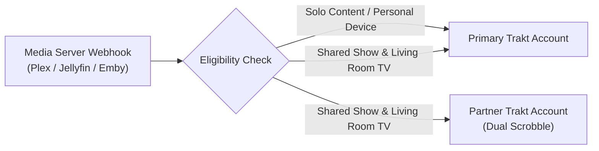
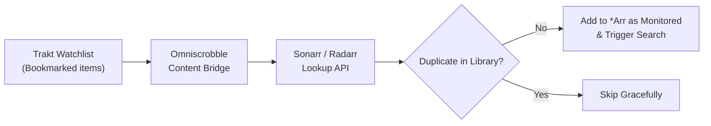
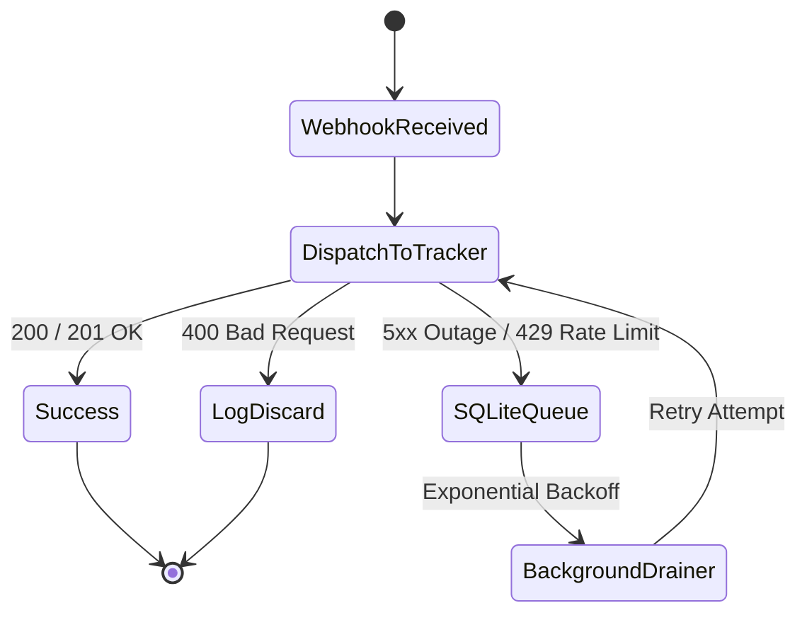

# Omniscrobble — Feature Guides & Deep Dives

This document provides in-depth technical guides for Omniscrobble's advanced capabilities, including multi-user co-watching, two-way library reconciliation, Sonarr/Radarr content bridging, offline resilience, and multi-channel notifications.

---

## Table of Contents

1. [Watch Together (Co-Watching) & Multi-User Accounts](#1-watch-together-co-watching--multi-user-accounts)
2. [Two-Way Synchronization & Multi-Server Reconciliation](#2-two-way-synchronization--multi-server-reconciliation)
3. [Content Bridge & *Arr Automation](#3-content-bridge--arr-automation)
4. [Persistent Offline Queue & Disaster Recovery](#4-persistent-offline-queue--disaster-recovery)
5. [Library Filtering & Trakt Collection Sync](#5-library-filtering--trakt-collection-sync)
6. [Multi-Channel Notifications & Throttling](#6-multi-channel-notifications--throttling)
7. [Homelab Observability & Prometheus Scrape](#7-homelab-observability--prometheus-scrape)

---

## 1. Watch Together (Co-Watching) & Multi-User Accounts

When watching movies or TV series together on a shared living room profile, Omniscrobble automatically dual-scrobbles watch history to **both** your Trakt profile and your partner's profile simultaneously, while keeping solo binges exclusive to your own account.



### Key Capabilities

- **Dynamic Show Whitelist**: Define shared series in `.env` or manage them on the fly directly from the dashboard without service restarts. Includes live Sonarr autocomplete.
- **Hardware Player Filtering (`CO_WATCH_PLAYERS`)**: Restrict dual-scrobbling to specific devices (such as living room Apple TVs or Nvidia Shields) so playback on bedroom phones or tablets remains solo.
- **Movie Co-Watching**: Toggle movie dual-sync with 1 click on the dashboard (`POST /api/cowatch/settings`).
- **Partner Token Isolation**: Partner credentials are stored securely in dedicated token files (`data/tokens/{username}_tokens.json`) with independent OAuth refresh cycles.
- **Partner Multi-Tracker Cloud Destinations**: Partners can link their own secondary trackers (Simkl, AniList, MAL) alongside Trakt. Scrobbling dispatches to all partner-authenticated platforms with isolated failure recovery. Proactive token refresh runs automatically every 12 hours.

### Configuration

```ini
# Partner Trakt username
CO_WATCH_USER=partner_username

# Comma-separated list of TV show titles to dual-scrobble
CO_WATCH_SHOWS=The Bear, Severance, House of the Dragon, Succession

# (Optional) Comma-separated player device names to restrict dual-scrobbling to
CO_WATCH_PLAYERS=Living Room Apple TV, Shield TV Pro, LG OLED C2
```

### Authorization

1. Open `http://<your-server-ip-or-domain>:<PORT>/auth?user=partner_username` in your web browser.
2. Have your partner sign in to Trakt and enter the 8-character activation code at [trakt.tv/activate](https://trakt.tv/activate).
3. Once authorized, all shared viewing on designated players will automatically scrobble to both profiles.

> 📖 For full multi-user variable options, see [**Watch Together & Multi-User Accounts**](../CONFIGURATION.md#5-watch-together--multi-user-accounts) in `CONFIGURATION.md`.

---

## 2. Two-Way Synchronization & Multi-Server Reconciliation

Standard scrobbling is one-directional (Media Server $\to$ Trakt). Omniscrobble features a bi-directional reconciliation engine that bridges your media server libraries (**Plex**, **Jellyfin**, **Emby**) with your Trakt and Simkl cloud history.

### Supported Platforms & Status

| Platform | Direct API Sync | Watched Status | Star Ratings | Verification Status |
| :--- | :---: | :---: | :---: | :--- |
| **Plex** | ✅ Yes | ✅ Yes | ✅ Yes | ✅ **Verified** (Maintainer daily driver) |
| **Jellyfin** | ✅ Yes | ✅ Yes | ✅ Yes | 🧪 **Community Beta** (Unit-tested to MediaBrowser spec) |
| **Emby** | ✅ Yes | ✅ Yes | ✅ Yes | 🧪 **Community Beta** (Unit-tested to MediaBrowser spec) |
| **Trakt.tv** | ✅ Yes | ✅ Yes | ✅ Yes | ✅ **Verified** (Primary cloud tracker) |
| **Simkl** | ✅ Yes | ✅ Yes | ✅ Yes | ✅ **Verified** (Dual-tracker engine) |

### Reconciliation Capabilities

- **Intelligent GUID Matching**: Compares Trakt cloud history against your libraries via IMDb, TMDb, and TVDb IDs, detecting discrepancies:
  - `Trakt Only`: Watched on Trakt but unwatched on the media server.
  - `Server Only`: Watched on the media server but unrecorded on Trakt.
  - `Rating Mismatch`: Star rating differences between platforms.
- **Smart Echo Loop Prevention (`LoopPreventionManager`)**: An in-memory TTL cache drops outgoing webhooks triggered by server updates during reconciliation, preventing infinite scrobble ping-pong loops.
- **Interactive Diff & Selective Sync UI**: Inspect all discrepancies on the dashboard, filter by discrepancy type, select specific titles, and trigger 1-click batch updates with real-time progress bars.
- **Automated Background Cloud Reconciliation**: An asynchronous background worker (`CloudSyncManager`) periodically syncs two-way watch history, generates Letterboxd RFC-4180 CSV snapshots (`data/exports/letterboxd_diary.csv`), and enforces shared mutex lock protection against concurrency collisions (`HTTP 409 Conflict`).

### Two-Way Sync Configuration

```ini
# Direct Media Server API Access for Reconciliation
PLEX_URL=http://<your-server-ip-or-domain>:32400
PLEX_TOKEN=your_plex_token_here

JELLYFIN_URL=http://<your-server-ip-or-domain>:8096
JELLYFIN_API_KEY=your_jellyfin_api_key_here
JELLYFIN_USER_ID=your_jellyfin_user_id_here

EMBY_URL=http://<your-server-ip-or-domain>:8096
EMBY_API_KEY=your_emby_api_key_here
EMBY_USER_ID=your_emby_user_id_here
```

> 📖 For visual token extraction guides, see [**Media Server Credentials & Webhook Setup**](../CONFIGURATION.md#2-media-server-credentials--webhook-setup) in `CONFIGURATION.md`.

---

## 3. Content Bridge & *Arr Automation

The **Content Bridge** connects your personal Trakt Watchlist (`/sync/watchlist`) directly to **Radarr** and **Sonarr** for automated media acquisition and instant Trakt collection sync upon download.



### Automation Features

- **Automated Watchlist Ingestion**: Scans your Trakt Watchlist for newly bookmarked movies and shows, checking for duplicates before queuing.
- **Intelligent Quality & Root Routing**: Queries Sonarr/Radarr lookup APIs by TMDb/TVDb ID, automatically selecting valid root folders and quality profiles.
- **Instant Indexer Search**: Adds media as monitored and immediately initiates indexer search requests when `SEARCH_ON_ADD=true`.
- **Download & Collection Webhooks**: Ingests Sonarr and Radarr `Download` notifications to instantly update your Trakt collection with exact media specs (resolution, audio codec, and channels).
- **Ecosystem Health Monitor**: Monitor server latency, versions, and trigger 1-click manual watchlist syncs directly from the dashboard (`GET /api/ecosystem`).

### Content Bridge Configuration

```ini
# Enable Trakt Watchlist -> *Arr Auto-Grab
AUTO_ADD_FROM_WATCHLIST=true
SEARCH_ON_ADD=true
ARR_WATCHLIST_INTERVAL=3600

# Sonarr (TV Shows)
SONARR_ENABLED=true
SONARR_URL=http://<your-server-ip-or-domain>:8989
SONARR_API_KEY=your_sonarr_api_key_here

# Radarr (Movies)
RADARR_ENABLED=true
RADARR_URL=http://<your-server-ip-or-domain>:7878
RADARR_API_KEY=your_radarr_api_key_here
```

> 📖 For Quality Profile IDs and Root Folder configuration, see [**Acquisition Stack (*Arr Automation)**](../CONFIGURATION.md#3-acquisition-stack-arr-automation) in `CONFIGURATION.md`.

---

## 4. Persistent Offline Queue & Disaster Recovery

Omniscrobble provides enterprise-grade resilience to protect your watch history during upstream tracker outages, internet interruptions, and host migrations.



### SQLite Offline Queue (`data/queue.db`)

- **Automatic Buffering**: If Trakt or Simkl return transient 5xx server errors or 429 rate limit responses, events are immediately enqueued into an ACID-compliant SQLite database.
- **Intelligent Classification**: Differentiates between recoverable transient errors (HTTP 500/502/503/504, 429, timeouts) and permanent errors (HTTP 400/404), discarding malformed requests to prevent queue poisoning.
- **Exponential Backoff Worker**: A background worker drains pending queue items as soon as connectivity recovers, honoring upstream `Retry-After` headers.

### 1-Click System Backup & Restore

- **Snapshot Export (`GET /api/backup`)**: Downloads a timestamped zip archive containing your configuration (`settings.json`), statistics (`stats.json`), co-watching rules (`cowatch_shows.json`), and encrypted OAuth token caches.
- **Safe Drag-and-Drop Restore (`POST /api/restore`)**: Restore settings instantly via the web dashboard. Includes built-in Zip Slip path sanitization to guarantee safe extraction.

---

## 5. Library Filtering & Trakt Collection Sync

### Library Section Whitelisting & Blacklisting

Isolate personal, home video, or fitness recordings from being scrobbled to public tracker profiles:

```ini
# Only scrobble items from these libraries:
ALLOWED_LIBRARIES="Movies, TV Shows, Anime"

# Or exclude specific libraries:
EXCLUDED_LIBRARIES="Home Videos, Fitness, Recorded TV"
```

### Automated Trakt Collection Sync

When enabled (`SYNC_COLLECTION=true`), newly imported media (`library.new`) is submitted directly to your Trakt collection with parsed technical specifications:

- **Resolution**: 4K UHD, 1080p, 720p, SD.
- **Audio Codec**: TrueHD Atmos, DTS-HD MA, EAC3, AC3, AAC, FLAC.
- **Audio Channels**: 7.1, 5.1, 2.0.

---

## 6. Multi-Channel Notifications & Throttling

Deliver real-time notifications with rich poster artwork, star ratings, and direct links when media is scrobbled, rated, or added to your collection.

### Supported Channels

| Channel | Configuration Keys | Embed Support |
| :--- | :--- | :---: |
| **Discord** | `DISCORD_WEBHOOK_URL` | Rich Embeds with Posters |
| **Telegram** | `TELEGRAM_BOT_TOKEN`, `TELEGRAM_CHAT_ID` | Markdown Messages |
| **Ntfy** | `NTFY_URL`, `NTFY_AUTH_TOKEN` | Push Notifications |
| **Pushover** | `PUSHOVER_USER_KEY`, `PUSHOVER_API_TOKEN` | Priority Push Alerts |

### Event Notification Toggles

```ini
NOTIFY_ON_SCROBBLE=true
NOTIFY_ON_RATE=true
NOTIFY_ON_COLLECTION=true
NOTIFY_ON_FAILURE=true
```

### Dashboard Runtime Configuration & Channel Testing

All notification channels and event toggles can be configured and managed live from the **Settings Hub ⚙️ &rarr; 🔔 Notifications** tab in the dashboard without editing `.env` or restarting services.

- **1-Click Test Buttons**: Verify delivery for Discord, Telegram, Ntfy, or Pushover with instant visual status feedback directly in the modal.
- **Credential Privacy**: Webhook URLs, bot tokens, auth tokens, and user keys are shielded (`••••••••`) in UI inputs and API payloads.

### Alert Throttling & Cooldowns

When upstream tracker API requests fail or during mass library additions, Omniscrobble applies an in-memory 30-minute deduplication cooldown per title to protect your notification channels from alert fatigue and webhook rate limits.

> 📖 For step-by-step bot setup and webhook creation, see [**Multi-Channel Notification Setup**](../CONFIGURATION.md#6-multi-channel-notification-setup) in `CONFIGURATION.md`.

---

## 7. Homelab Observability & Prometheus Scrape

Omniscrobble exposes native Prometheus metrics at `/metrics` when `PROMETHEUS_METRICS_ENABLED=true`.

### Prometheus Scrape Job Configuration

Add the following job to your Prometheus server `prometheus.yml`:

```yaml
scrape_configs:
  - job_name: 'omniscrobble'
    metrics_path: '/metrics'
    scrape_interval: 15s
    scrape_timeout: 10s
    static_configs:
      - targets: ['<your-server-ip-or-domain>:<PORT>']
```

### Real-Time Terminal Log Viewer

- Access live service logs directly from the dashboard modal (`GET /api/logs`).
- Backed by `journalctl` on systemd deployments and an in-memory ring buffer on Docker.
- **Automated Secret Redaction**: All query tokens (`?token=...`), Bearer headers, and media server API keys are scrubbed before reaching the browser.
- **Interactive Controls**: Filter by log severity (`INFO`, `WARNING`, `ERROR`), search by keyword, and auto-scroll live log streams.

> 📖 For full metric type specifications and Prometheus query examples, see [**Prometheus Metrics**](./API.md#prometheus-metrics) in `docs/API.md`.
