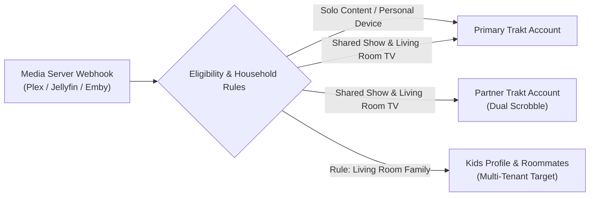
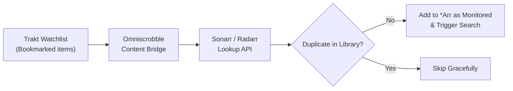
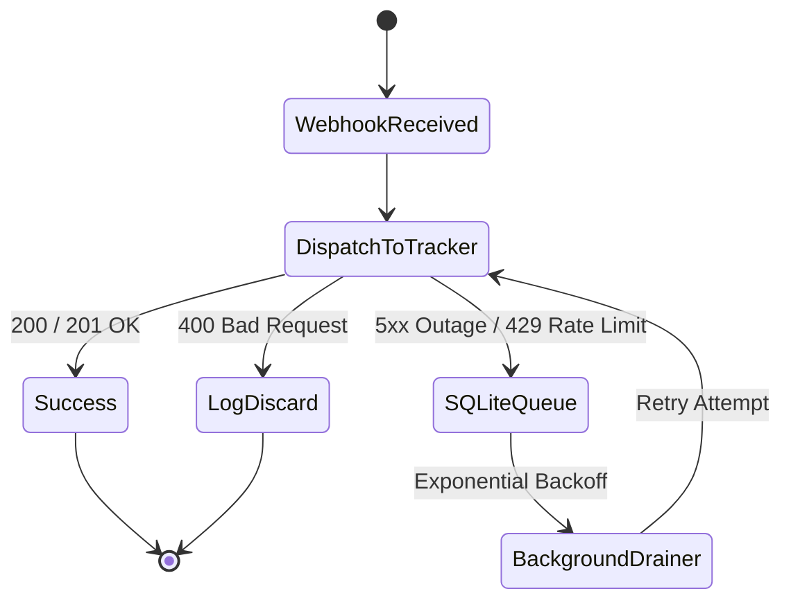
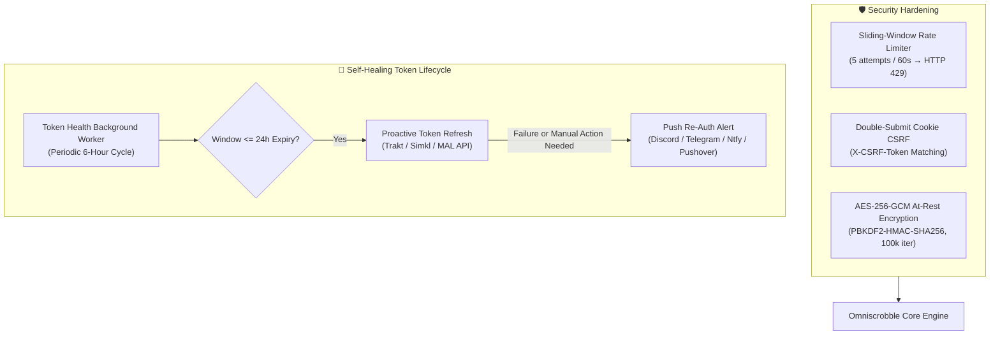
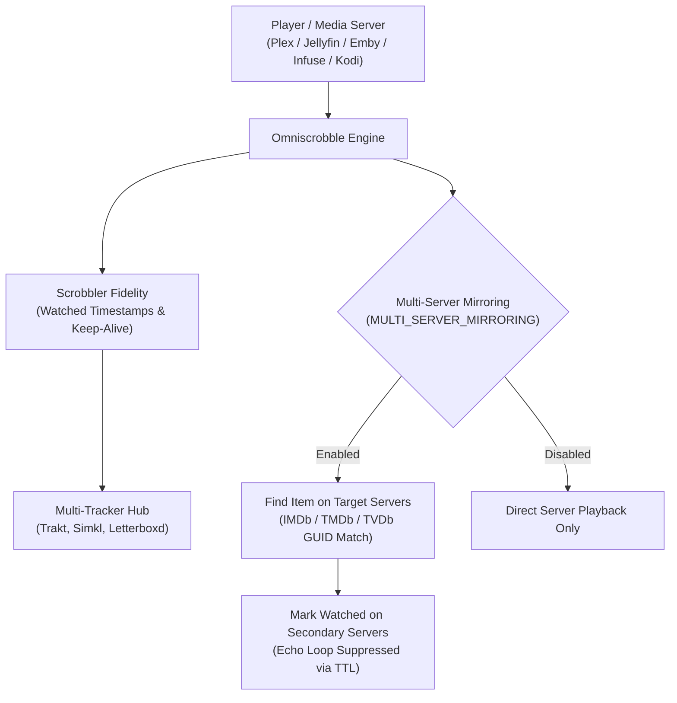
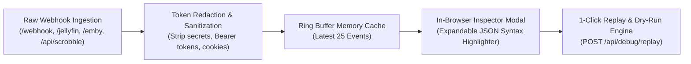

# Omniscrobble — Feature Guides & Deep Dives

This document provides in-depth technical guides for Omniscrobble's advanced capabilities, including multi-user co-watching, two-way library reconciliation, Sonarr/Radarr content bridging, offline resilience, and multi-channel notifications.

---

## Table of Contents

1. [Watch Together (Co-Watching) & Household Multi-Tenancy](#1-watch-together-co-watching--household-multi-tenancy)
2. [Two-Way Synchronization & Multi-Server Reconciliation](#2-two-way-synchronization--multi-server-reconciliation)
3. [Content Bridge & *Arr Automation](#3-content-bridge--arr-automation)
4. [Persistent Offline Queue & Disaster Recovery](#4-persistent-offline-queue--disaster-recovery)
5. [Library Filtering & Trakt Collection Sync](#5-library-filtering--trakt-collection-sync)
6. [Multi-Channel Notifications & Throttling](#6-multi-channel-notifications--throttling)
7. [Homelab Observability & Prometheus Scrape](#7-homelab-observability--prometheus-scrape)
8. [Multi-Theme Palette Engine & Accents](#8-multi-theme-palette-engine--accents)
9. [Ambient Visuals, Display Density & Card Customization](#9-ambient-visuals-display-density--card-customization)
10. [Production Security & Self-Healing Resilience](#10-production-security--self-healing-resilience)
11. [Scrobbler Fidelity & Multi-Server Real-Time Mirroring](#11-scrobbler-fidelity--multi-server-real-time-mirroring)
12. [In-Browser Webhook Inspector & Payload Debugger](#12-in-browser-webhook-inspector--payload-debugger)
13. [Personal Viewing Analytics & OmniWrapped](#13-personal-viewing-analytics--omniwrapped)
14. [Dashboard Workspaces & Navigation](#14-dashboard-workspaces--navigation)

---

## 1. Watch Together (Co-Watching) & Household Multi-Tenancy

When watching movies or TV series together on a shared living room profile or across family rooms, Omniscrobble automatically dual-scrobbles watch history to **both** your Trakt profile and your partner's profile simultaneously, while keeping solo binges exclusive to your own account. For households with 3 or more members, the **Household Routing Engine** extends this into arbitrary multi-profile routing.



### Key Capabilities

- **Household Multi-Tenant Routing (3+ Users)**: Configure granular routing rules targeting arbitrary user profiles (`data/tokens/{username}_tokens.json`) based on playback device (e.g. `Living Room Apple TV`), media types (`movie`, `episode`), and shows (`*` or specific series).
- **Dynamic Show Whitelist**: Define shared series in `.env` or manage them on the fly directly from the dashboard without service restarts. Includes live Sonarr autocomplete.
- **Hardware Player Filtering (`CO_WATCH_PLAYERS`)**: Restrict dual-scrobbling to specific devices (such as living room Apple TVs or Nvidia Shields) so playback on bedroom phones or tablets remains solo.
- **Movie Co-Watching**: Toggle movie dual-sync with 1 click on the dashboard (`POST /api/cowatch/settings`).
- **Partner Token Isolation**: Partner credentials are stored securely in dedicated token files (`data/tokens/{username}_tokens.json`) with independent OAuth refresh cycles.
- **Partner Multi-Tracker Cloud Destinations**: Partners can link their own secondary trackers (Simkl, AniList, MAL) alongside Trakt. Scrobbling dispatches to all partner-authenticated platforms with isolated failure recovery. Proactive token refresh runs automatically every 12 hours.

### Configuration

```ini
# Partner Trakt username
CO_WATCH_USER=partner_username

# Comma-separated list of TV show titles to dual-scrobble
CO_WATCH_SHOWS=The Bear, Severance, House of the Dragon, Succession

# (Optional) Comma-separated player device names to restrict dual-scrobbling to
CO_WATCH_PLAYERS=Living Room Apple TV, Shield TV Pro, LG OLED C2
```

### Authorization

1. Open `http://<your-server-ip-or-domain>:<PORT>/auth?user=partner_username` in your web browser.
2. Have your partner sign in to Trakt and enter the 8-character activation code at [trakt.tv/activate](https://trakt.tv/activate).
3. Once authorized, all shared viewing on designated players will automatically scrobble to both profiles.

> 📖 For full multi-user variable options, see [**Watch Together & Multi-User Accounts**](../CONFIGURATION.md#5-watch-together--multi-user-accounts) in `CONFIGURATION.md`.

---

## 2. Two-Way Synchronization & Multi-Server Reconciliation

Standard scrobbling is one-directional (Media Server $\to$ Trakt). Omniscrobble features a bi-directional reconciliation engine that bridges your media server libraries (**Plex**, **Jellyfin**, **Emby**) with your Trakt and Simkl cloud history.

### Supported Platforms & Status

| Platform | Direct API Sync | Watched Status | Star Ratings | Verification Status |
| :--- | :---: | :---: | :---: | :--- |
| **Plex** | ✅ Yes | ✅ Yes | ✅ Yes | ✅ **Verified** (Maintainer daily driver) |
| **Jellyfin** | ✅ Yes | ✅ Yes | ✅ Yes | 🧪 **Community Beta** (Unit-tested to MediaBrowser spec) |
| **Emby** | ✅ Yes | ✅ Yes | ✅ Yes | 🧪 **Community Beta** (Unit-tested to MediaBrowser spec) |
| **Trakt.tv** | ✅ Yes | ✅ Yes | ✅ Yes | ✅ **Verified** (Primary cloud tracker) |
| **Simkl** | ✅ Yes | ✅ Yes | ✅ Yes | ✅ **Verified** (Dual-tracker engine) |

### Reconciliation Capabilities

- **Intelligent GUID Matching**: Compares Trakt cloud history against your libraries via IMDb, TMDb, and TVDb IDs, detecting discrepancies:
  - `Trakt Only`: Watched on Trakt but unwatched on the media server.
  - `Server Only`: Watched on the media server but unrecorded on Trakt.
  - `Rating Mismatch`: Star rating differences between platforms.
- **Smart Echo Loop Prevention (`LoopPreventionManager`)**: An in-memory TTL cache drops outgoing webhooks triggered by server updates during reconciliation, preventing infinite scrobble ping-pong loops.
- **Interactive Diff & Selective Sync UI**: Inspect all discrepancies on the dashboard, filter by discrepancy type, select specific titles, and trigger 1-click batch updates with real-time progress bars.
- **Memory-Efficient Chunked Discrepancy Streamer**: For massive media libraries (10,000+ items), the reconciliation scanner streams diffs in paginated chunks (`GET /api/sync/diff?cursor=...&limit=50`), maintaining sub-50MB RAM consumption and sub-second UI responsiveness.
- **Automated Background Cloud Reconciliation**: An asynchronous background worker (`CloudSyncManager`) periodically syncs two-way watch history, generates Letterboxd RFC-4180 CSV snapshots (`data/exports/letterboxd_diary.csv`), and enforces shared mutex lock protection against concurrency collisions (`HTTP 409 Conflict`).
- **1-Click Webhook Auto-Registration**: Automatically registers Omniscrobble's webhook endpoint in Plex (via `plex.tv/api/v2/user/webhooks`), Jellyfin (via Webhook plugin configuration), and Emby (via `/Webhooks`) directly from the Settings Hub, eliminating manual copy-pasting.

### Two-Way Sync Configuration

```ini
# Direct Media Server API Access for Reconciliation
PLEX_URL=http://<your-server-ip-or-domain>:32400
PLEX_TOKEN=your_plex_token_here

JELLYFIN_URL=http://<your-server-ip-or-domain>:8096
JELLYFIN_API_KEY=your_jellyfin_api_key_here
JELLYFIN_USER_ID=your_jellyfin_user_id_here

EMBY_URL=http://<your-server-ip-or-domain>:8096
EMBY_API_KEY=your_emby_api_key_here
EMBY_USER_ID=your_emby_user_id_here
```

> 📖 For visual token extraction guides, see [**Media Server Credentials & Webhook Setup**](../CONFIGURATION.md#2-media-server-credentials--webhook-setup) in `CONFIGURATION.md`.

---

## 3. Content Bridge & *Arr Automation

The **Content Bridge** connects your personal Trakt Watchlist (`/sync/watchlist`) directly to **Radarr** and **Sonarr** for automated media acquisition and instant Trakt collection sync upon download.

Admins can also search Sonarr and Radarr catalogs from the dashboard or with `Cmd+K`, choose the service's root folder and quality profile, and add a result with monitoring/search options. Series can optionally be enrolled in Co-Watch during addition; that checkbox starts unchecked and the API defaults `enable_cowatch` to `false`.



### Automation Features

- **Automated Watchlist Ingestion**: Scans your Trakt Watchlist for newly bookmarked movies and shows, checking for duplicates before queuing.
- **Intelligent Quality & Root Routing**: Queries Sonarr/Radarr lookup APIs by TMDb/TVDb ID, automatically selecting valid root folders and quality profiles.
- **Instant Indexer Search**: Adds media as monitored and immediately initiates indexer search requests when `SEARCH_ON_ADD=true`.
- **Overseerr & Jellyseerr Request Bridge**: Intelligently routes Trakt Watchlist bookmarks to Overseerr/Jellyseerr requests (honoring user quotas, quality profiles, and approval workflows) as an alternative to direct Sonarr/Radarr ingestion, falling back automatically if disabled or media already exists.
- **Download & Collection Webhooks**: Ingests Sonarr and Radarr `Download` notifications to instantly update your Trakt collection with exact media specs (resolution, audio codec, and channels).
- **Ecosystem Health Monitor**: Monitor server latency, versions, and trigger 1-click manual watchlist syncs directly from the dashboard (`GET /api/ecosystem`).

### Content Bridge Configuration

```ini
# Enable Trakt Watchlist -> *Arr Auto-Grab
AUTO_ADD_FROM_WATCHLIST=true
SEARCH_ON_ADD=true
ARR_WATCHLIST_INTERVAL=3600

# Sonarr (TV Shows)
SONARR_ENABLED=true
SONARR_URL=http://<your-server-ip-or-domain>:8989
SONARR_API_KEY=your_sonarr_api_key_here

# Radarr (Movies)
RADARR_ENABLED=true
RADARR_URL=http://<your-server-ip-or-domain>:7878
RADARR_API_KEY=your_radarr_api_key_here
```

> 📖 For Quality Profile IDs and Root Folder configuration, see [**Acquisition Stack (*Arr Automation)**](../CONFIGURATION.md#3-acquisition-stack-arr-automation) in `CONFIGURATION.md`.

---

## 4. Persistent Offline Queue & Disaster Recovery

Omniscrobble provides enterprise-grade resilience to protect your watch history during upstream tracker outages, internet interruptions, and host migrations.



### SQLite Offline Queue (`data/queue.db`)

- **Automatic Buffering**: If Trakt or Simkl return transient 5xx server errors or 429 rate limit responses, events are immediately enqueued into an ACID-compliant SQLite database.
- **Intelligent Classification**: Differentiates between recoverable transient errors (HTTP 500/502/503/504, 429, timeouts) and permanent errors (HTTP 400/404), discarding malformed requests to prevent queue poisoning.
- **Exponential Backoff Worker**: A background worker drains pending queue items as soon as connectivity recovers, honoring upstream `Retry-After` headers.
- **Automated Retention & Pruning (`POST /api/queue/prune`)**: To prevent unbounded SQLite disk growth over years of operation, the background worker automatically prunes successfully completed and expired offline queue records older than 90 days during its daily maintenance sweep. Administrators can also trigger on-demand queue pruning via the REST API.

### 1-Click System Backup & Restore

- **Snapshot Export (`GET /api/backup`)**: Downloads a timestamped zip archive containing your configuration (`settings.json`), statistics (`stats.json`), co-watching rules (`cowatch_shows.json`), and encrypted OAuth token caches.
- **Safe Drag-and-Drop Restore (`POST /api/restore`)**: Restore settings instantly via the web dashboard. Includes built-in Zip Slip path sanitization to guarantee safe extraction.

---

## 5. Library Filtering & Trakt Collection Sync

### Library Section Whitelisting & Blacklisting

Isolate personal, home video, or fitness recordings from being scrobbled to public tracker profiles:

```ini
# Only scrobble items from these libraries:
ALLOWED_LIBRARIES="Movies, TV Shows, Anime"

# Or exclude specific libraries:
EXCLUDED_LIBRARIES="Home Videos, Fitness, Recorded TV"
```

### Automated Trakt Collection Sync

When enabled (`SYNC_COLLECTION=true`), newly imported media (`library.new`) is submitted directly to your Trakt collection with parsed technical specifications:

- **Resolution**: 4K UHD, 1080p, 720p, SD.
- **Audio Codec**: TrueHD Atmos, DTS-HD MA, EAC3, AC3, AAC, FLAC.
- **Audio Channels**: 7.1, 5.1, 2.0.

---

## 6. Multi-Channel Notifications & Throttling

Deliver real-time notifications with rich poster artwork, star ratings, and direct links when media is scrobbled, rated, or added to your collection.

### Supported Channels

| Channel | Configuration Keys | Embed Support |
| :--- | :--- | :---: |
| **Discord** | `DISCORD_WEBHOOK_URL` | Rich Embeds with Posters & Action Row Link Buttons |
| **Telegram** | `TELEGRAM_BOT_TOKEN`, `TELEGRAM_CHAT_ID` | Markdown Messages |
| **Ntfy** | `NTFY_URL`, `NTFY_AUTH_TOKEN` | Push Notifications |
| **Pushover** | `PUSHOVER_USER_KEY`, `PUSHOVER_API_TOKEN` | Priority Push Alerts |
| **Gotify** | `GOTIFY_URL`, `GOTIFY_TOKEN`, `GOTIFY_PRIORITY` | Self-Hosted Push Alerts |
| **Matrix** | `MATRIX_HOMESERVER_URL`, `MATRIX_ACCESS_TOKEN`, `MATRIX_ROOM_ID` | Formatted Room Alerts |

### Event Notification Toggles

```ini
NOTIFY_ON_SCROBBLE=true
NOTIFY_ON_RATE=true
NOTIFY_ON_COLLECTION=true
NOTIFY_ON_FAILURE=true
```

### Scheduled Weekly Activity Digest

Omniscrobble includes a built-in background scheduled digest engine (`DigestManager`) that automatically compiles 7-day watch activity metrics (total watch time, completed movies & episodes, ratings, co-watched sessions, active media servers, and playback clients) and dispatches formatted reports across all enabled notification channels.

```ini
# Weekly digest configuration
WEEKLY_DIGEST_ENABLED=true
WEEKLY_DIGEST_DAY=sunday
WEEKLY_DIGEST_HOUR=20
```

### Dashboard Runtime Configuration & Channel Testing

All notification channels, event toggles, and weekly digest settings can be configured and managed live from the **Settings Hub ⚙️ &rarr; 🔔 Notifications** tab in the dashboard without editing `.env` or restarting services.

- **1-Click Test Buttons**: Verify delivery for Discord, Telegram, Ntfy, Pushover, Gotify, or Matrix with instant visual status feedback directly in the modal.
- **⚡ Send Digest Now**: Test and immediately trigger a full activity digest across active notification channels or in demo mode.
- **Credential Privacy**: Webhook URLs, bot tokens, auth tokens, and user keys are shielded (`••••••••`) in UI inputs and API payloads.

### Alert Throttling & Cooldowns

When upstream tracker API requests fail or during mass library additions, Omniscrobble applies an in-memory 30-minute deduplication cooldown per title to protect your notification channels from alert fatigue and webhook rate limits.

> 📖 For step-by-step bot setup and webhook creation, see [**Multi-Channel Notification Setup**](../CONFIGURATION.md#6-multi-channel-notification-setup) in `CONFIGURATION.md`.

---

## 7. Homelab Observability & Prometheus Scrape

Omniscrobble exposes native Prometheus metrics at `/metrics` when `PROMETHEUS_METRICS_ENABLED=true`.

### Prometheus Scrape Job Configuration

Add the following job to your Prometheus server `prometheus.yml`:

```yaml
scrape_configs:
  - job_name: 'omniscrobble'
    metrics_path: '/metrics'
    scrape_interval: 15s
    scrape_timeout: 10s
    static_configs:
      - targets: ['<your-server-ip-or-domain>:<PORT>']
```

### Real-Time Terminal Log Viewer

- Access live service logs directly from the dashboard modal (`GET /api/logs`).
- Backed by `journalctl` on systemd deployments and an in-memory ring buffer on Docker.
- **Automated Secret Redaction**: All query tokens (`?token=...`), Bearer headers, and media server API keys are scrubbed before reaching the browser.
- **Interactive Controls**: Filter by log severity (`INFO`, `WARNING`, `ERROR`), search by keyword, and auto-scroll live log streams.

> 📖 For full metric type specifications and Prometheus query examples, see [**Prometheus Metrics**](./API.md#prometheus-metrics) in `docs/API.md`.

---

## 8. Multi-Theme Palette Engine & Accents

Omniscrobble includes a comprehensive, client-side appearance engine featuring 8 curated dark palettes and 9 accent colors.

### Curated Dark Palettes

| Palette | Description | Base Tone |
| :--- | :--- | :--- |
| **Slate** | Oceanic Slate (Default) | Deep navy slate `#0f172a` |
| **OLED** | True Black | Pure black `#000000` for OLED displays |
| **Nord** | Arctic Frost & Polar Night | Muted arctic blue-gray `#242933` |
| **Catppuccin** | Mocha | Warm, comforting dark `#181825` |
| **Tokyo Night** | Cyberpunk Neon Dark | Modern deep indigo `#1a1b26` |
| **Dracula** | Vampire Contrast | Classic high-contrast dark `#21222c` |
| **Emerald** | Forest Obsidian | Rich dark pine `#061a14` |
| **Rosé Pine** | Natural Aesthetic | Soft vintage pine `#191724` |

### Primary Accent Highlights

Customize buttons, links, and system badges with 9 accent colors: `Sky` (default blue), `Amber`, `Trakt Red`, `Plex Gold`, `Jellyfin Purple`, `Emerald Green`, `Cyan`, `Rosé Pink`, and `Mauve`.

### Zero-FOUC (Flash of Unstyled Content)

Theme selections are persisted in browser `localStorage` and restored via an inline synchronous `<head>` script prior to DOM rendering, guaranteeing zero flicker or flash of unstyled content during navigation or reloads.

### Global Keyboard Shortcuts

Control Omniscrobble quickly with keyboard navigation:

- <kbd>T</kbd>: Cycle to the next theme palette.
- <kbd>S</kbd>: Open the Settings Hub modal.
- <kbd>L</kbd>: Open the Live Terminal Log viewer.
- <kbd>R</kbd>: Refresh live activity feed and offline queue status.
- <kbd>?</kbd>: Open the Keyboard Shortcuts reference modal.
- <kbd>Esc</kbd>: Close the active modal dialog.

---

## 9. Ambient Visuals, Display Density & Card Customization

Omniscrobble provides interface customization options designed for desktop browsers, home theater setups, and wall-mounted dashboard tablets.

### Ambient Stream Poster & Frosted Backdrop

The active playback banner card dynamically presents media artwork extracted from media server payloads:

- **Frosted Glass Ambient Backdrop**: A wide, ambient-blurred backdrop (`filter: blur(35px); opacity: 0.22`) renders behind active playback information, echoing modern streaming interfaces.
- **Leading Poster Thumbnail**: High-resolution movie and episode artwork with a smooth fallback icon (`🎬`) for untracked home videos.
- **CDN Resolution Fallback**: When media servers provide local or relative thumbnail URLs, Omniscrobble automatically resolves poster and fanart backdrops via the Metahub CDN (`https://images.metahub.space/`) using standard IMDb IDs.

### Display Density Modes

Toggle between two display density modes directly from the **Appearance** tab in the Settings Hub:

- **Comfortable** (Default): Spacious layout with generous card padding (24px) and relaxed table heights.
- **Compact**: Condensed spacing with streamlined card padding (14px) and tighter table row heights. Specifically optimized for wall-mounted tablet displays (such as iPad, Amazon Fire HD, and WallPanel kiosks) to fit all essential scrobbler telemetry without requiring vertical scrolling.
- **Zero-FOUC**: The chosen density mode is saved to `omniscrobble_density` in `localStorage` and injected during early document parsing via an inline `<head>` script, ensuring no flash of unstyled content on reload.

### Dashboard Card Customization

Customize the dashboard to display only the features you actively use:

- **Individual Card Visibility**: Turn off cards you do not need (such as *Arr Content Bridge if you don't run Sonarr/Radarr, Watch Together if viewing solo, or Two-Way Reconciliation if you only perform real-time scrobbling).
- **Instant Toggles**: Manage card visibility in the Settings Hub Appearance tab with live preview.
- **1-Click Reset**: Restore default card layout instantly with the **Reset to Default** button.
- **Pre-Render Style Injection**: Disabled cards are suppressed before first paint via an inline `<style id="fouc-card-style">` element, preventing layout shift on page load.

---

## 10. Production Security & Self-Healing Resilience

Omniscrobble implements an enterprise-grade defense-in-depth security model and proactive token health lifecycle engine designed to prevent unauthorized credential tampering, mitigate cross-site attacks, and eliminate authentication dropouts before they disrupt background scrobbling.



### 1. At-Rest Token & Configuration Encryption

When `CONFIG_ENCRYPTION_KEY` is provided in `.env` or system environment:

- **AES-256-GCM Symmetric Encryption**: All sensitive token files (`trakt_tokens.json`, `simkl_tokens.json`, `mal_tokens.json`, `anilist_token.json`, and all partner accounts in `data/tokens/*.json`) as well as dynamic settings (`data/settings.json`) are encrypted at rest with authenticated AES-256-GCM.
- **Key Derivation (PBKDF2-HMAC-SHA256)**: Encryption keys are derived using 100,000 iterations with 16-byte cryptographically secure random salts.
- **Passphrase-Protected Backups**: The `/api/backup` export endpoint accepts a custom passphrase to encrypt zip archives into authenticated JSON envelopes (`OPBK`), preventing credential leaks in cloud backups.
- **Backward-Compatible Fallback**: If `CONFIG_ENCRYPTION_KEY` is unset, Omniscrobble seamlessly reads and writes standard unencrypted JSON files without migration headaches.

### 2. Double-Submit Cookie CSRF Protection

- **Cookie-Authenticated Mutating Gates**: When administrative access is granted via browser cookies (`admin_token`), all state-changing HTTP requests (`POST`, `DELETE`, `PUT`, `PATCH`) require a cryptographically matching `X-CSRF-Token` header.
- **Transparent `window.fetch` Interceptor**: The web dashboard automatically injects `X-CSRF-Token` from the `csrf_token` cookie into all outbound requests, ensuring zero friction for authorized users.
- **External Webhook Isolation**: Media server webhooks and automated scripts authenticating via `?token=` query parameters or `x-webhook-secret` headers bypass CSRF checks, ensuring automated scripts and local media servers continue to operate unimpeded.
- **Cookie SameSite Policies**: Configurable `COOKIE_SAMESITE` (default `lax`) enforces strict origin isolation on session cookies.

### 3. Sliding-Window Unlock Rate Limiting

- **Brute-Force Lockout**: The `/api/admin/unlock` endpoint tracks failed password attempts per client IP. After 5 consecutive failures within a rolling 60-second window, subsequent attempts are rejected with `HTTP 429 Too Many Requests` and a standard `Retry-After: 60` response header.
- **Sanitized Audit Telemetry**: All lockout events and invalid unlock attempts emit sanitized warning logs (`log_mgr.sanitize_line(client_ip)`), preventing terminal injection or log tampering.

### 4. Proactive Token Expiration & Push Health Alerts

- **Proactive Renewal Engine (`TokenHealthMonitor`)**: Rather than waiting for a media scrobble to fail with HTTP 401, a dedicated background worker continuously tracks token lifetimes (`created_at + expires_in`).
- **24-Hour Renewal Window**: Any OAuth token within 24 hours of expiration is automatically refreshed in the background.
- **Actionable Re-Authorization Alerts**: If an upstream service revokes access or automatic refresh fails, Omniscrobble sends a high-priority alert across your configured notification channels (Discord, Telegram, Ntfy, Pushover) with an instant 1-click re-authorization link. Alerts are throttled to 1 per 24 hours per service to eliminate spam.
- **REST Telemetry**: Detailed token expiration statuses and remaining lifespans are queryable via `GET /api/health/tokens`.

---

## 11. Scrobbler Fidelity & Multi-Server Real-Time Mirroring

Omniscrobble delivers high-fidelity scrobbling precision and unified multi-server state synchronization across your homelab ecosystem.



### 1. Rewatch Detection & Accurate Play Counts

When re-watching favorite movies or re-running classic TV series, naive scrobblers often fail to increment play counts or overwrite previous watch timestamps. Omniscrobble ensures full fidelity:

- **Explicit ISO-8601 `watched_at` Timestamps**: Captures exact UTC completion timestamps upon scrobble and passes them explicitly to Trakt, Simkl, and Letterboxd (`watched_at_ts`).
- **Play Count Increments**: By providing distinct completion timestamps, Trakt and Simkl accurately increment your lifetime play count rather than discarding requests as duplicates.
- **Letterboxd Diary Fidelity**: When exporting or logging to Letterboxd, rewatches are detected against prior logs (`is_rewatch = True`, `"Rewatch": "Yes"`), appending a new dated diary entry rather than modifying earlier history.

### 2. Live Scrobble Keep-Alive Heartbeat

Upstream cloud trackers (such as Trakt and Simkl) maintain a "Watching Now" live banner that automatically expires if no keep-alive pulses are received within 10 to 15 minutes. During extended movies, pause breaks, or network interruptions, your profile would prematurely show as offline.

- **Background Heartbeat Worker (`scrobble_heartbeat_worker_loop`)**: Asynchronously tracks active playback sessions in `PlaybackManager`.
- **Periodic 10-Minute Refresh**: When a stream has been active for more than 10 minutes without a recent progress update, Omniscrobble dispatches a keep-alive `scrobble_start` signal to Trakt and Simkl.
- **Graceful Lifecycle**: Stops tracking immediately when media is paused, stopped, or scrobbled, preventing orphan stream states.

### 3. Multi-Server Real-Time Mirroring (Plex ⇄ Jellyfin / Emby)

For users running multiple media servers side-by-side (e.g. Plex for remote sharing and Jellyfin or Emby for local home theater streaming), Omniscrobble mirrors watch progress and ratings across all configured servers:

- **Cross-Server Identification (`find_item`)**: When a watch event finishes on Server A, Omniscrobble searches active target servers using provider IDs (IMDb, TMDb, TVDb) or normalized title/year.
- **Instant Synchronization**: Marks the item as watched or applies user ratings on target servers via direct REST API client calls.
- **Smart Echo Suppression**: Target server updates are registered in `LoopPreventionManager` (`ttl=180.0s`), ensuring outbound webhooks generated by the target servers do not trigger infinite sync loops.
- **Zero Impact by Default**: Disabled on clean installs (`MULTI_SERVER_MIRRORING=false`). Toggle on via `.env` or in the **Dashboard Settings Hub &rarr; Two-Way Reconciliation** panel.

### 4. Standalone Player Direct REST Bridge (`POST /api/scrobble`)

For lightweight or portable setups running without a centralized media server (such as Infuse on Apple TV, Kodi on a Raspberry Pi, VLC, or Stremio), Omniscrobble provides a direct REST scrobbling bridge:

- **Self-Documenting Info Endpoint (`GET /api/scrobble`)**: Returns endpoint documentation, parameter definitions, and JSON payload schemas.
- **Unified Action Ingestion (`POST /api/scrobble`)**: Ingests direct playback lifecycle payloads (`action: "play" | "pause" | "stop" | "scrobble"`) with title, media type, season/episode, and metadata provider IDs (`imdb`, `tmdb`, `tvdb`).
- **Webhook Secret Protection**: Secures standalone player scrobbling via `?token=<SECRET>` query parameters or `x-webhook-secret` headers.

---

## 12. In-Browser Webhook Inspector & Payload Debugger

Omniscrobble includes an in-memory raw webhook ring buffer and debugger (`WebhookDebugger`) that captures incoming media server payloads across Plex, Jellyfin, Emby, Radarr, Sonarr, and standalone players.



### Webhook Inspector Capabilities

- **Automatic Credential Sanitization**: Redacts sensitive authorization tokens, cookies, webhooks secrets, and passwords in both request headers and JSON payloads (`[REDACTED]`).
- **Processing Provenance & Status**: Tracks whether events were scrobbled, queued, test-verified, or ignored (due to library filters or user whitelists) with detailed rationale.
- **Interactive Syntax Highlighting**: Inspect formatted, syntax-highlighted JSON trees with copy-to-clipboard buttons directly inside the dashboard.
- **1-Click Replay Bridge**: Test webhook payloads against your current scrobbling rules in dry-run mode or dispatch them through the live multi-tracker pipeline.

---

## 13. Personal Viewing Analytics & OmniWrapped

The **Statistics Hub** computes lifetime and time-windowed viewing telemetry directly from activity events and scrobble counters, powering rich metrics and the yearly **OmniWrapped** retrospective.

### Telemetry & Metrics

- **Cumulative Watch Hours**: Formatted viewing time calculations across movies (110m avg) and TV episodes (45m avg).
- **Solo vs. Co-Watch Ratio**: Visual distribution bar comparing solo screen time against shared viewing sessions with your partner.
- **Multi-Server Distribution**: Percentage badges tracking where playback originated (Plex vs. Jellyfin vs. Emby).
- **Top Series & Genre Affinity**: Live aggregation of your most-watched shows and genre breakdown.
- **Personality Archetypes**: Evaluates annual viewing habits and assigns custom homelab archetypes:
  - *The Living Room Co-Watcher* (&ge; 40% co-watch ratio)
  - *The Silver Screen Cinephile* (movie-dominated viewing)
  - *The Grand Homelab Binger* (> 100 watch hours)
  - *The Curated Media Connoisseur* (selective, high-fidelity viewing)
- **Exportable Retrospectives**: Export complete OmniWrapped JSON summaries for archiving or sharing.

---

## 14. Dashboard Workspaces & Navigation

The dashboard groups its existing cards into five workspaces to make frequent operations easier to reach. Tracker configuration shortcuts open the matching integration section in the Settings Hub, while co-watch partner linking keeps its user-specific authorization flow. Live Logs and Webhook Inspector share a tabbed diagnostics drawer.

| Workspace | Contents |
| :--- | :--- |
| **Operations** | Active playback and live activity history |
| **Trackers & Hub** | Server and account status, media server listeners, tracker connections, and reconciliation |
| **Automation** | Watch Together and Sonarr/Radarr bridges |
| **Analytics** | Viewing trends and OmniWrapped insights |
| **System** | Backups and recovery controls |

Operations is the default. The selected workspace is remembered in browser local storage. Tabs support arrow-key navigation, and on small screens the navigation stays within reach in a fixed bottom dock. The health strip summarizes account connection, active listeners, and offline queue count; detailed controls remain in their corresponding workspace cards.

The activity stream includes media-type and delivery-status chips, a user selector, and title/user search. Each event shows the recorded result for applicable trackers; asynchronous Simkl, AniList, and MAL updates are attached to the same persisted event when they finish. Anime filtering uses the event's `is_anime` metadata when available. With auto-refresh enabled, new event rows animate into view and a brief toast announces each arrival. `Ctrl+K` / `⌘K` opens a searchable action palette for workspace navigation, manual scrobbling, queue retry, logs, reconciliation, theme selection, and *Arr search. Live Logs and Webhook Inspector share a tabbed right-side drawer, leaving the dashboard available behind it.
